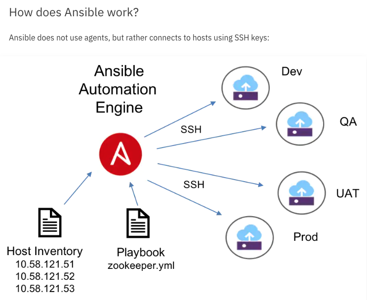

# azure-ansible

Examples of the Python Ansible library with Azure VMs

## Ansible Links

- https://docs.microsoft.com/en-us/azure/ansible/
- https://www.ansible.com
- https://docs.ansible.com
- https://pypi.org/project/ansible/ 

- https://www.ansible.com/integrations/infrastructure/windows
- https://docs.ansible.com/ansible/latest/modules/list_of_windows_modules.html
- https://docs.ansible.com/ansible/latest/modules/list_of_cloud_modules.html
- https://www.azuredevopslabs.com/labs/vstsextend/ansible/
- https://azure.microsoft.com/en-us/services/virtual-machines/data-science-virtual-machines/

---

## Diagram



---

## Setup for this example repo

Instructions for macOS and Linux, Windows PowerShell is similar:
Assumes Python 3.7+ is present.

```
$ git clone https://github.com/cjoakim/azure-ansible.git
$ cd azure-ansible
$ python --version
Python 3.7.6
$ ./venv.sh              # Installs the python virtual environment, ansible and other libraries 
$ source bin/activate    # Activate the python virtual environment
$ ansible --version
ansible 2.9.5
```

### Create your Data Science Virtual Machines (DSVMs)

```
$ cd az_cli/
$ ./gen_ssh_key.sh     (optional, generates an id_rsa key)
$ ./dsvm1.sh create ; ./dsvm2.sh create ; ./dsvm3.sh create
```

The above uses your **id_rsa ssh key**.

See the **tmp/dsvm<n>_vm_create.json** files to obtain the IP Address of each DSVM.

### ssh into your DSVMs to test connectivity

```
$ ssh -A <your-user-id>@<your-dsvm-ip>
$ ssh -A chris@1.2.3.4
```

Note: be sure your current shell is using your **id_rsa key**; add it as follows:
```
$ cd ~/.ssh ; ssh-add id_rsa
```

### Edit Your Ansible **hosts** file to have your VM IP addresses

```
[dsvmeastus]
137.135.93.34

[dsvmwestus]
40.78.56.214

[dsvmjapaneast]
52.185.174.78

[dsvmus]
137.135.93.34
40.78.56.214

[dsvmall]
137.135.93.34
40.78.56.214
52.185.174.78
```

### Edit Your **ansible.cfg** file

```
[defaults]
inventory = hosts
remote_user = cjoakim

[ssh_connection]
ssh_args = -o ControlMaster=auto -o ControlPersist=120s -A
```

### Ping your hosts with Ansible via ssh

```
$ ansible dsvmall -m ping

...

52.185.174.78 | SUCCESS => {
    "ansible_facts": {
        "discovered_interpreter_python": "/usr/bin/python"
    },
    "changed": false,
    "ping": "pong"
}
```

---

## Example Use

### Remotely configure the git user and clone a github repo to the remote VMs

```
$ ansible-playbook git-setup.yml
```

### Pull the latest version of a git repo

```
$ ansible-playbook git-pull.yml
```

Same command with verbose debug information:
```
$ export ANSIBLE_DEBUG=1 ; ansible-playbook git-pull.yml
```

### Install the DotNet Core 3.1 SDK on the Ubuntu VM

This remotely executes a bash shell script on the VM.
```
$ ansible-playbook install-dotnet-core.yml
```

#### Version: 2020/03/11 12:12
